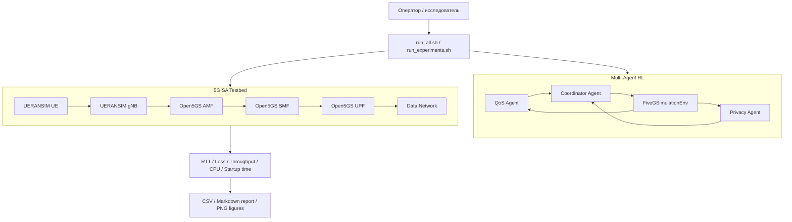

# Adaptive 5G Stack Tuning with Multi-Agent Reinforcement Learning

Экспериментальный стенд **5G Standalone** на базе **Open5GS + UERANSIM** с многоагентной системой обучения с подкреплением для адаптивной настройки параметров сети, анализа компромисса QoS/Privacy и воспроизводимого проведения экспериментов.

## Содержание

- [Возможности](#возможности)
- [Архитектура](#архитектура)
- [Структура проекта](#структура-проекта)
- [Требования](#требования)
- [Клонирование и подготовка](#клонирование-и-подготовка)
- [Настройка 5G-стенда](#настройка-5g-стенда)
- [Сборка C-эмулятора](#сборка-c-эмулятора)
- [Обучение MARL](#обучение-marl)
- [Запуск живого стенда](#запуск-живого-стенда)
- [Эксперименты](#эксперименты)
- [Графики](#графики)
- [Результаты](#результаты)
- [Остановка и очистка](#остановка-и-очистка)
- [Устранение ошибок](#устранение-ошибок)
- [Git и публикация](#git-и-публикация)
- [Ограничения](#ограничения)

## Возможности

Проект позволяет:

- развернуть локальное 5G SA-ядро Open5GS в Docker;
- подключить UERANSIM gNB и UE;
- выполнить регистрацию UE и установление PDU-сессии;
- обучить три Q-learning агента;
- сравнить MARL с фиксированной baseline-политикой;
- оценить компромисс QoS и конфиденциальности;
- провести ablation study агентов;
- измерить zero-touch время развёртывания;
- исследовать работу при динамических сетевых условиях;
- сохранять модели, CSV, отчёты и PNG-графики.

## Архитектура



### Агенты

| Агент | Назначение | Примеры наблюдений | Примеры действий |
|---|---|---|---|
| QoS Agent | Оптимизация качества обслуживания | throughput, latency, loss, stability | профиль скорости/задержки |
| Privacy Agent | Снижение privacy exposure | уровень телеметрии, детализация данных | minimal/standard/detailed |
| Coordinator Agent | Баланс локальных целей | награды агентов, состояние сети | веса QoS/Privacy/Stability |

Обобщённая награда строится по нескольким критериям:

```text
GlobalReward = w_qos * QoS + w_privacy * Privacy + w_stability * Stability
```

Конкретные коэффициенты и пространство действий задаются в `marl/config/experiment.json`.

## Структура проекта

```text
5G_emulation/
├── README.md
├── run_experiments.sh
├── docker/
│   └── docker-compose.yml
├── docs/
├── emulator-c/
│   ├── Makefile
│   └── src/
├── external/
│   └── docker_open5gs/
│       ├── sa-deploy.yaml
│       ├── nr-gnb.yaml
│       ├── nr-ue.yaml
│       └── .env
├── marl/
│   ├── config/experiment.json
│   ├── marl5g/
│   ├── models/
│   ├── results/
│   ├── scripts/
│   └── run_all.sh
├── experiments/
│   ├── common/
│   ├── exp01_baseline/
│   ├── exp02_marl_vs_baseline/
│   ├── exp03_dynamic_load/
│   ├── exp04_privacy_tradeoff/
│   ├── exp05_agent_ablation/
│   ├── exp06_zero_touch_startup/
│   └── exp07_algorithm_comparison/
└── scripts/
    ├── generate_plots.py
    ├── start.sh
    ├── stop.sh
    └── test_ping.sh
```

> Каталог `5g_marl_package/`, появившийся после распаковки архива, является копией. Для работы используется корневой каталог `marl/`; дубликат можно удалить.

## Требования

Рекомендуемая среда:

- Ubuntu 22.04/24.04 или WSL2;
- Docker Engine и Docker Compose v2;
- Python 3.9+;
- GNU Make и GCC;
- доступ к `sudo` для сетевых операций;
- не менее 8 GB RAM;
- свободные порты `3000`, `9090`, `9999`.

Установка основных пакетов в Ubuntu:

```bash
sudo apt update
sudo apt install -y \
  git make gcc python3 python3-venv python3-pip \
  iproute2 iputils-ping unzip curl
```

Проверка Docker:

```bash
docker --version
docker compose version
docker run --rm hello-world
```

## Клонирование и подготовка

```bash
git clone <URL_РЕПОЗИТОРИЯ> 5G_emulation
cd 5G_emulation
```

Выдать права скриптам:

```bash
chmod +x marl/run_all.sh
chmod +x marl/scripts/*.sh
chmod +x run_experiments.sh
chmod +x experiments/*/run.sh
chmod +x experiments/common/*.sh
chmod +x scripts/*.sh
```

Создать Python-окружение:

```bash
python3 -m venv .venv
source .venv/bin/activate
python3 -m pip install --upgrade pip
python3 -m pip install -r marl/requirements.txt
python3 -m pip install matplotlib
```

## Настройка 5G-стенда

### 1. Настройка `.env`

Перейти в каталог Open5GS:

```bash
cd external/docker_open5gs
```

Проверить основные параметры:

```dotenv
MCC=001
MNC=01
TAC=1
AMF_IP=172.22.0.10
NR_GNB_IP=172.22.0.23
```

### 2. Subscriber

Subscriber должен быть создан в Open5GS WebUI хотя бы один раз.

После запуска Core WebUI доступен по адресу:

```text
http://localhost:9999
```

Параметры тестового subscriber:

| Поле | Значение |
|---|---|
| MCC | `001` |
| MNC | `01` |
| IMSI | `001011234567895` |
| Key | хранить локально, не публиковать |
| OP/OPc | хранить локально, не публиковать |
| AMF | `8000` |
| APN/DNN | `internet` |

> Не коммитьте реальные `K`, `OP`, `OPc`, пароли и персональные IMSI. Используйте `.env.example` и тестовые значения.

### 3. Ручной запуск для диагностики

Core:

```bash
cd external/docker_open5gs
docker compose -f sa-deploy.yaml up -d
```

gNB:

```bash
docker compose -f nr-gnb.yaml up -d
```

UE:

```bash
docker compose -f nr-ue.yaml up -d
```

Проверка:

```bash
docker ps
docker logs nr_gnb --tail 50
docker logs nr_ue --tail 50
docker exec nr_ue ip addr show uesimtun0
```

Успешный запуск содержит строки:

```text
NG Setup procedure is successful
Initial Registration is successful
PDU Session establishment is successful
TUN interface[uesimtun0, ...] is up
```

## Сборка C-эмулятора

```bash
cd emulator-c
make clean
make
```

Запуск:

```bash
./emulator
```

Если Makefile поддерживает отдельные цели, посмотреть их можно командой:

```bash
make help 2>/dev/null || cat Makefile
```

## Обучение MARL

### Полный surrogate-цикл

Из корня проекта:

```bash
./marl/run_all.sh
```

Или по шагам:

```bash
cd marl
python3 -m marl5g.train
python3 -m marl5g.evaluate
python3 -m marl5g.report
```

Создаются:

```text
marl/models/qos.json
marl/models/privacy.json
marl/models/coordinator.json
marl/results/training.csv
marl/results/evaluation.csv
marl/results/REPORT.md
```

### Конфигурация обучения

```bash
cat marl/config/experiment.json
```

Перед изменением параметров рекомендуется сохранять конфигурацию эксперимента:

```bash
cp marl/config/experiment.json \
   marl/config/experiment.backup.json
```

## Запуск живого стенда

```bash
./marl/run_all.sh live
```

Скрипт:

1. обучает агентов;
2. оценивает MARL и baseline;
3. запускает Open5GS Core;
4. запускает gNB;
5. запускает UE;
6. ожидает `uesimtun0`;
7. добавляет живые метрики в `marl/results/live_probe.csv`.

Проверка маршрута UE:

```bash
docker exec nr_ue ip route
docker exec nr_ue ping -c 4 -I uesimtun0 8.8.8.8
docker exec nr_ue ping -c 4 -I uesimtun0 google.com
```

## Эксперименты

Общий интерфейс:

```bash
./run_experiments.sh <experiment>
```

Доступные сценарии:

| Команда | Эксперимент | Тип среды | Основной результат |
|---|---|---|---|
| `exp01` | Baseline стенда | live | startup, RTT, loss |
| `exp02` | MARL vs baseline | surrogate | reward, throughput, latency, privacy |
| `exp03` | Dynamic load | live | временной ряд при `tc/netem` |
| `exp04` | Privacy trade-off | surrogate | QoS/Privacy компромисс |
| `exp05` | Agent ablation | surrogate | вклад каждого агента |
| `exp06` | Zero-touch startup | live | время до готовой PDU-сессии |
| `exp07` | Algorithm comparison | surrogate/status | статус Q-learning/EXP3/DQN |
| `all` | безопасная серия | surrogate | exp02, exp04, exp05, exp07 |

### Experiment 01 — Baseline

```bash
./run_experiments.sh exp01
```

Параметры:

```bash
cat experiments/exp01_baseline/config.env
```

Для итогового исследования рекомендуется:

```dotenv
REPEATS=20
PING_TARGET=8.8.8.8
PING_COUNT=10
```

Результаты:

```text
experiments/exp01_baseline/raw/runs.csv
experiments/exp01_baseline/results/summary.csv
```

### Experiment 02 — MARL vs baseline

```bash
./run_experiments.sh exp02
```

Результаты:

```text
experiments/exp02_marl_vs_baseline/raw/training.csv
experiments/exp02_marl_vs_baseline/raw/evaluation.csv
experiments/exp02_marl_vs_baseline/results/REPORT.md
```

### Experiment 03 — Dynamic load

```bash
./run_experiments.sh exp03
```

Эксперимент применяет сетевые условия через `tc netem` к `uesimtun0`.

Проверить текущую дисциплину очереди:

```bash
docker exec nr_ue tc qdisc show dev uesimtun0
```

Сбросить условия вручную:

```bash
docker exec nr_ue tc qdisc del dev uesimtun0 root 2>/dev/null || true
```

Результат:

```text
experiments/exp03_dynamic_load/raw/timeline.csv
```

### Experiment 04 — Privacy trade-off

```bash
./run_experiments.sh exp04
```

Результат:

```text
experiments/exp04_privacy_tradeoff/results/privacy_tradeoff.csv
```

Уровни privacy являются модельными и не означают фактическую передачу ключей абонента.

### Experiment 05 — Agent ablation

```bash
./run_experiments.sh exp05
```

Сравниваются полная MARL-система и конфигурации с отключёнными агентами.

Результат:

```text
experiments/exp05_agent_ablation/results/ablation.csv
```

### Experiment 06 — Zero-touch startup

```bash
./run_experiments.sh exp06
```

Для 20 повторов:

```bash
mkdir -p experiments/exp06_zero_touch_startup/raw/series

for i in $(seq -w 1 20); do
  echo "Zero-touch run $i"
  ./run_experiments.sh exp06
  cp experiments/exp06_zero_touch_startup/raw/startup.csv \
     experiments/exp06_zero_touch_startup/raw/series/run_${i}.csv
done
```

Результат одного запуска:

```text
experiments/exp06_zero_touch_startup/raw/startup.csv
```

### Experiment 07 — Algorithm comparison

```bash
./run_experiments.sh exp07
```

В текущем MVP реализован Q-learning. EXP3 и DQN должны отмечаться как planned, пока их код и реальные результаты отсутствуют.

### Безопасный пакет surrogate-экспериментов

```bash
./run_experiments.sh all
```

Live-сценарии `exp01`, `exp03`, `exp06` намеренно не входят в `all`, чтобы избежать многократных перезапусков Docker.

## Графики

Установить Matplotlib:

```bash
source .venv/bin/activate
python3 -m pip install matplotlib
```

Сгенерировать все доступные графики:

```bash
python3 scripts/generate_plots.py
```

Графики сохраняются в:

```text
artifacts/figures/
```

Ожидаемые файлы:

```text
training_reward.png
policy_reward.png
policy_throughput.png
policy_latency.png
policy_privacy.png
baseline_metrics.png
privacy_tradeoff.png
agent_ablation.png
dynamic_load.png
zero_touch_startup.png
```

Скрипт не падает, если часть экспериментов ещё не проведена: отсутствующие CSV будут пропущены.

### Графики вручную в Jupyter

```bash
python3 -m pip install jupyter pandas matplotlib
jupyter notebook
```

Минимальный пример:

```python
import pandas as pd
import matplotlib.pyplot as plt

training = pd.read_csv("marl/results/training.csv")
training.plot(x="episode", y="reward_coordinator")
plt.xlabel("Episode")
plt.ylabel("Coordinator reward")
plt.tight_layout()
plt.show()
```

## Результаты

Пример результата surrogate-оценки текущего MVP:

| Policy | Throughput, Mbps | Latency, ms | Packet loss | Privacy exposure | Global reward |
|---|---:|---:|---:|---:|---:|
| Baseline | 19.315 | 41.098 | 0.00705 | 0.40 | 0.385 |
| MARL | 45.314 | 34.676 | 0.01103 | 0.11 | 0.611 |

Интерпретация:

- throughput вырос;
- latency снизилась;
- модельный privacy exposure снизился;
- global reward вырос;
- packet loss немного увеличился, поэтому результат нельзя описывать как улучшение абсолютно всех метрик.

> Эти значения получены в surrogate-среде. Их нельзя выдавать за измерения физической или Docker-сети. Реальные сетевые данные формируют `exp01`, `exp03`, `exp06` и `live_probe.csv`.

## Остановка и очистка

Остановка UE и gNB:

```bash
cd external/docker_open5gs
docker compose -f nr-ue.yaml down
docker compose -f nr-gnb.yaml down
```

Остановка Core:

```bash
docker compose -f sa-deploy.yaml down
```

Сохранить subscriber и MongoDB volume:

```bash
docker compose -f sa-deploy.yaml down
```

Полностью удалить volumes, включая базу subscriber:

```bash
# Осторожно: подписки будут удалены.
docker compose -f sa-deploy.yaml down -v
```

## Устранение ошибок

### `./run_all.sh: No such file or directory`

Скрипт находится в `marl/`:

```bash
./marl/run_all.sh
./marl/run_all.sh live
```

### `ImportError: FiveGEnvironment`

В текущем MARL-модуле используется класс `FiveGSimulationEnv`.

Проверка:

```bash
grep -R "class FiveG" -n marl/marl5g/environment.py
```

В `exp04` и `exp05` импорт должен соответствовать реальному имени класса.

### `address already in use: 9090`

Проверить порт:

```bash
sudo ss -ltnp | grep ':9090' || true
docker ps -a --format 'table {{.Names}}\t{{.Ports}}' | grep 9090 || true
```

Удалить устаревший metrics-контейнер:

```bash
docker rm -f metrics 2>/dev/null || true
```

Если порт занят системным Prometheus:

```bash
sudo systemctl stop prometheus
```

### `Found orphan containers`

Это предупреждение возникает из-за использования нескольких Compose-файлов. Не применяйте `--remove-orphans` вслепую: можно удалить нужные Core/gNB/UE контейнеры.

Проверить контейнеры:

```bash
docker ps --format 'table {{.Names}}\t{{.Status}}\t{{.Ports}}'
```

### UE не регистрируется

```bash
docker logs nr_ue --tail 100
docker logs nr_gnb --tail 100
docker logs amf --tail 100
```

Проверить совпадение:

- MCC/MNC/TAC;
- IMSI;
- K и OP/OPc;
- AMF;
- DNN/APN;
- IP gNB и AMF.

### `SQN out of range`

Пересоздать subscriber или синхронизировать SQN в MongoDB, затем пересоздать UE:

```bash
docker rm -f nr_ue 2>/dev/null || true
cd external/docker_open5gs
docker compose -f nr-ue.yaml up -d
```

### Проверка успешности 5G-сессии

```bash
docker logs nr_ue 2>&1 | grep -E \
  'Initial Registration is successful|PDU Session establishment is successful|uesimtun0'
```

## Git и публикация

### 1. Проверить, что секреты не попадут в Git

```bash
git status --short
git grep -nE '(KEY|OPC|OP=|PASSWORD|SECRET)' -- . ':!external/docker_open5gs/.env.example' || true
```

Рекомендуемый `.gitignore`:

```gitignore
.venv/
__pycache__/
*.py[cod]
.env
external/docker_open5gs/.env
.DS_Store
.vscode/
.idea/

# Runtime logs
*.log

# Optional generated artifacts
# artifacts/figures/
# experiments/*/raw/
```

Для научной воспроизводимости можно коммитить итоговые CSV/PNG, но не временные логи и секреты.

### 2. Удалить дубликаты и кэш

```bash
rm -rf 5g_marl_package
find . -type d -name __pycache__ -prune -exec rm -rf {} +
find . -type f -name '*.pyc' -delete
```

### 3. Проверить изменения

```bash
git status
git diff --stat
git diff -- README.md
```

### 4. Создать ветку и коммит

```bash
git switch -c feature/marl-experiments

git add \
  README.md \
  marl \
  experiments \
  run_experiments.sh \
  scripts/generate_plots.py \
  docs \
  emulator-c

git commit -m "feat: add reproducible MARL experiments for 5G testbed"
```

### 5. Настроить remote

```bash
git remote -v
```

Если `origin` отсутствует:

```bash
git remote add origin https://github.com/<USERNAME>/<REPOSITORY>.git
```

### 6. Авторизация GitHub CLI

```bash
sudo apt install -y gh
gh auth login
```

Выбрать:

```text
GitHub.com
HTTPS
Login with a web browser
```

### 7. Push

```bash
git push -u origin feature/marl-experiments
```

Если проект нужно отправить прямо в `main`:

```bash
git switch main
git merge --no-ff feature/marl-experiments
git push origin main
```

Безопаснее сначала открыть Pull Request:

```bash
gh pr create \
  --title "Add MARL training and reproducible 5G experiments" \
  --body "Adds Open5GS/UERANSIM integration, multi-agent Q-learning, experiment runners, reports and plots."
```

## Ограничения

- обучение MVP выполняется в surrogate-среде;
- live-режим пока в основном собирает метрики, а не обучает тысячи шагов непосредственно на стенде;
- privacy exposure является модельной метрикой;
- EXP3/DQN/MAPPO не следует объявлять реализованными без кода и воспроизводимых результатов;
- Docker-стенд не эквивалентен физической радиосети;
- результаты зависят от оборудования, ОС, Docker и фоновой нагрузки.

## Воспроизводимость

Для каждого итогового эксперимента сохраняйте:

- Git commit hash;
- `experiment.json`;
- random seed;
- дату и время;
- версию Docker;
- версию Python;
- характеристики компьютера;
- сырые CSV;
- обработанные таблицы;
- PNG-графики.

Команды фиксации окружения:

```bash
git rev-parse HEAD
python3 --version
docker --version
docker compose version
uname -a
lscpu | sed -n '1,20p'
free -h
```

## Лицензии и сторонние компоненты

Open5GS, UERANSIM и другие внешние компоненты распространяются на условиях собственных лицензий. Перед публикацией проверьте `external/docker_open5gs/LICENSE` и лицензии исходных репозиториев.
