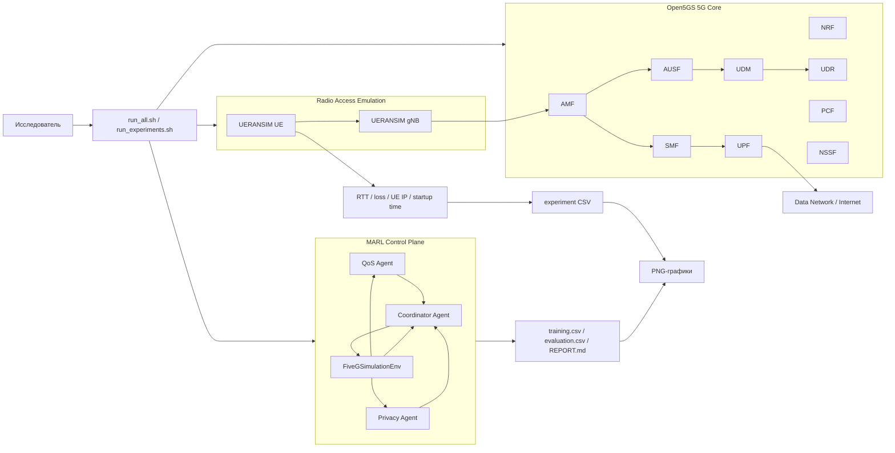

# PROJECT_GUIDE — Adaptive 5G Stack Tuning with Multi-Agent Reinforcement Learning

## 1. Назначение документа

Этот документ является подробным руководством разработчика и исследователя для проекта `5G_emulation`.
Он описывает:

- назначение проекта;
- архитектуру 5G-стенда;
- взаимодействие Open5GS, UERANSIM и MARL;
- структуру каталогов;
- подготовку операционной системы;
- настройку subscriber;
- сборку и запуск компонентов;
- обучение и оценку MARL;
- проведение всех экспериментов;
- форматы CSV и отчётов;
- построение графиков;
- диагностику типовых ошибок;
- безопасную публикацию проекта в GitHub;
- ограничения и правила интерпретации результатов.

Документ рассчитан на пользователя Ubuntu/Debian, который впервые клонировал репозиторий и хочет воспроизвести работу с нуля.

---

## 2. Краткое описание проекта

`5G_emulation` — экспериментальный стенд 5G Standalone, объединяющий:

1. **Open5GS** — программное ядро сети 5G Core;
2. **UERANSIM** — эмулятор базовой станции gNB и пользовательского оборудования UE;
3. **Docker Compose** — средство воспроизводимого развёртывания компонентов;
4. **Multi-Agent Reinforcement Learning** — систему из нескольких агентов, адаптивно выбирающих параметры сети;
5. **набор воспроизводимых экспериментов** — baseline, MARL vs baseline, динамическая нагрузка, privacy trade-off, ablation study, zero-touch startup и comparison scaffold;
6. **систему отчётности** — CSV-файлы, Markdown-отчёты и PNG-графики.

Главная исследовательская идея проекта состоит в том, чтобы показать, что параметры сети можно выбирать не только статически, но и адаптивно, используя многоагентное обучение с подкреплением.

---

## 3. Исследовательская задача

В традиционной конфигурации сетевые параметры задаются заранее и остаются неизменными. Такой подход плохо реагирует на изменение:

- нагрузки;
- задержки;
- потерь пакетов;
- доступной пропускной способности;
- загрузки вычислительных ресурсов;
- требований к объёму телеметрии и приватности.

В проекте рассматривается задача адаптивного выбора профиля управления. Система получает наблюдения о текущем состоянии среды и выбирает совместное действие нескольких агентов.

Упрощённо глобальная цель может быть представлена так:

```text
GlobalReward = w_qos * QoS
             + w_privacy * Privacy
             + w_stability * Stability
             - penalties
```

Где:

- `QoS` характеризует throughput, latency и packet loss;
- `Privacy` отражает минимизацию избыточной телеметрии;
- `Stability` штрафует слишком частые или резкие изменения конфигурации;
- `penalties` учитывают нарушения ограничений.

Конкретные коэффициенты определяются конфигурацией эксперимента и реализацией среды.

---

## 4. Архитектура решения

### 4.1. Логическая схема



### 4.2. Два уровня экспериментов

В проекте существуют два разных уровня исследований, и их нельзя смешивать.

#### Surrogate-среда

MARL обучается в программной среде `FiveGSimulationEnv`. Эта среда моделирует показатели сети и позволяет быстро выполнить большое число эпизодов.

Преимущества:

- высокая скорость;
- повторяемость по seed;
- отсутствие необходимости перезапускать Docker;
- удобство для обучения и сравнений политик.

Ограничение:

- показатели являются моделируемыми, а не измеренными непосредственно в Open5GS.

#### Live 5G testbed

Эксперименты `exp01`, `exp03` и `exp06` работают с контейнерами Open5GS и UERANSIM.

Они измеряют реальные для данного локального стенда величины:

- время запуска;
- наличие интерфейса `uesimtun0`;
- IP-адрес UE;
- RTT;
- packet loss;
- реакцию на `tc netem`.

В дипломной работе следует явно писать, какие результаты получены в surrogate-среде, а какие — на live-стенде.

---

## 5. Роли агентов MARL

### 5.1. QoS Agent

Задача агента — поддерживать качество обслуживания.

Типичные наблюдения:

- текущая пропускная способность;
- задержка;
- потери пакетов;
- нагрузка;
- стабильность предыдущего действия.

Типичные действия:

- выбор профиля bandwidth;
- выбор профиля delay/loss;
- изменение интенсивности управления;
- выбор более агрессивного или более консервативного режима.

### 5.2. Privacy Agent

Задача агента — контролировать объём и детализацию собираемой телеметрии.

Примерные уровни:

- `minimal` — минимальный объём данных;
- `standard` — сбалансированная детализация;
- `detailed` — наиболее полная телеметрия.

Чем выше детализация, тем больше информации получает система управления, но тем выше моделируемый privacy exposure.

### 5.3. Coordinator Agent

Coordinator балансирует локальные цели QoS и Privacy.

Он необходим, потому что максимизация throughput может конфликтовать с:

- минимизацией телеметрии;
- устойчивостью конфигурации;
- ограничениями ресурсов;
- требованиями приватности.

В текущей реализации агенты используют табличный Q-learning. Архитектурно проект соответствует идее CTDE: обучение может использовать глобальную информацию, а логика агентов остаётся разделённой.

---

## 6. Структура репозитория

Типовая структура:

```text
5G_emulation/
├── README.md
├── PROJECT_GUIDE.md
├── run_experiments.sh
├── .gitignore
│
├── external/
│   └── docker_open5gs/
│       ├── sa-deploy.yaml
│       ├── nr-gnb.yaml
│       ├── nr-ue.yaml
│       ├── .env
│       └── README.md
│
├── emulator-c/
│   ├── Makefile
│   ├── README.md
│   └── src/
│
├── marl/
│   ├── config/
│   │   └── experiment.json
│   ├── marl5g/
│   │   ├── __init__.py
│   │   ├── environment.py
│   │   ├── qlearning.py
│   │   ├── train.py
│   │   ├── evaluate.py
│   │   └── report.py
│   ├── scripts/
│   │   ├── start_testbed.sh
│   │   └── live_probe.sh
│   ├── models/
│   ├── results/
│   ├── requirements.txt
│   └── run_all.sh
│
├── experiments/
│   ├── common/
│   │   ├── testbed.sh
│   │   └── metrics.py
│   ├── exp01_baseline/
│   ├── exp02_marl_vs_baseline/
│   ├── exp03_dynamic_load/
│   ├── exp04_privacy_tradeoff/
│   ├── exp05_agent_ablation/
│   ├── exp06_zero_touch_startup/
│   └── exp07_algorithm_comparison/
│
├── scripts/
│   └── generate_plots.py
│
├── artifacts/
│   └── figures/
│
└── docs/
```

### 6.1. `external/docker_open5gs`

Содержит Docker Compose-файлы для ядра Open5GS, gNB и UE.

Основные файлы:

- `sa-deploy.yaml` — ядро 5G SA;
- `nr-gnb.yaml` — контейнер UERANSIM gNB;
- `nr-ue.yaml` — контейнер UERANSIM UE;
- `.env` — локальная конфигурация сети и subscriber;
- `README.md` — документация исходного Docker-стенда.

### 6.2. `marl`

Самостоятельный Python-пакет MARL.

- `environment.py` — среда `FiveGSimulationEnv`;
- `qlearning.py` — табличный Q-learning;
- `train.py` — обучение агентов;
- `evaluate.py` — сравнение baseline и обученной политики;
- `report.py` — формирование Markdown-отчёта;
- `config/experiment.json` — параметры обучения и среды;
- `models/*.json` — Q-таблицы агентов;
- `results/*.csv` — история обучения и оценки.

### 6.3. `experiments`

Набор сценариев, оформленных как отдельные воспроизводимые эксперименты.

Каждый эксперимент обычно содержит:

- `README.md` — цель и методика;
- `run.sh` или `run.py` — исполняемый сценарий;
- `raw/` — первичные данные;
- `results/` — агрегированные результаты.

### 6.4. `scripts/generate_plots.py`

Собирает CSV из стандартных каталогов и создаёт PNG-графики в `artifacts/figures`.

---

## 7. Требования к системе

Рекомендуется:

- Ubuntu 22.04, 24.04 или совместимый Debian-based Linux;
- Docker Engine;
- Docker Compose plugin v2;
- Python 3.9 или новее;
- Git;
- Make и GCC для C-компонентов;
- минимум 8 GB RAM;
- права `sudo`;
- доступ к созданию TUN-интерфейсов и сетевым namespace.

Проверка версии ОС:

```bash
cat /etc/os-release
uname -a
```

Проверка Python:

```bash
python3 --version
```

Проверка Docker:

```bash
docker --version
docker compose version
```

Проверка Git:

```bash
git --version
```

---

## 8. Установка системных зависимостей

```bash
sudo apt update
sudo apt install -y \
  git \
  make \
  gcc \
  build-essential \
  python3 \
  python3-full \
  python3-venv \
  python3-pip \
  iproute2 \
  iputils-ping \
  curl \
  unzip \
  jq
```

Если используется Python 3.14 и `python3 -m venv` сообщает, что `ensurepip` отсутствует:

```bash
sudo apt install -y python3.14-venv python3-full
```

Если пакет версии не найден:

```bash
sudo apt install -y python3-venv python3-full
```

Не рекомендуется устанавливать зависимости командой:

```bash
python3 -m pip install --break-system-packages ...
```

Причина: Ubuntu/Debian защищает системный Python согласно PEP 668. Правильный способ — виртуальное окружение.

---

## 9. Клонирование проекта

```bash
git clone https://github.com/FanOfLitov/5G_emulation.git
cd 5G_emulation
```

Проверить корень проекта:

```bash
pwd
ls -la
```

Выдать права исполняемым скриптам:

```bash
chmod +x marl/run_all.sh
chmod +x marl/scripts/*.sh
chmod +x run_experiments.sh
chmod +x experiments/*/run.sh
chmod +x experiments/common/*.sh
chmod +x scripts/*.py
```

Проверить shell-синтаксис:

```bash
bash -n marl/run_all.sh
bash -n run_experiments.sh
bash -n experiments/*/run.sh
bash -n experiments/common/*.sh
```

---

## 10. Создание Python virtual environment

Из корня проекта:

```bash
rm -rf .venv
python3 -m venv .venv
source .venv/bin/activate
```

После активации приглашение shell обычно начинается с `(.venv)`.

Проверить используемый Python:

```bash
which python
which pip
python --version
```

Ожидается, что пути указывают на:

```text
~/5G_emulation/.venv/bin/python
~/5G_emulation/.venv/bin/pip
```

Установить зависимости:

```bash
python -m pip install --upgrade pip
python -m pip install -r marl/requirements.txt
python -m pip install matplotlib
```

Проверить Matplotlib:

```bash
python -c "import matplotlib; print(matplotlib.__version__)"
```

В следующих сессиях повторно устанавливать пакеты не нужно:

```bash
cd ~/5G_emulation
source .venv/bin/activate
```

Выход из окружения:

```bash
deactivate
```

---

## 11. Настройка Docker

Если Docker установлен, но команды требуют `sudo`, можно добавить пользователя в группу Docker:

```bash
sudo usermod -aG docker "$USER"
```

После этого необходимо перелогиниться или выполнить:

```bash
newgrp docker
```

Проверка:

```bash
docker run --rm hello-world
```

Показать контейнеры:

```bash
docker ps
```

Показать все контейнеры, включая остановленные:

```bash
docker ps -a
```

---

## 12. Конфигурация 5G-сети

### 12.1. Основные параметры PLMN

Подтверждённая конфигурация стенда:

```dotenv
MCC=001
MNC=01
TAC=1
AMF_IP=172.22.0.10
NR_GNB_IP=172.22.0.23
```

Все компоненты должны использовать согласованные значения MCC, MNC и TAC.

### 12.2. gNB

Подтверждённые значения сгенерированной конфигурации:

```yaml
nci: 0x000000010
idLength: 32
```

Успешное подключение gNB к AMF подтверждается строкой:

```text
NG Setup procedure is successful
```

### 12.3. UE

Пример параметров тестового UE:

```yaml
supi: imsi-001011234567895
mcc: 001
mnc: 01
key: <LOCAL_TEST_KEY>
op: <LOCAL_TEST_OP>
amf: 8000
gnbSearchList: 172.22.0.23
```

Реальные `key`, `op`, `opc`, пароли и subscriber credentials не должны публиковаться.

### 12.4. Subscriber в Open5GS WebUI

Subscriber должен совпадать с конфигурацией UE по следующим полям:

- IMSI/SUPI;
- MCC/MNC;
- `K`;
- `OP` или `OPc`;
- AMF;
- DNN/APN, обычно `internet`.

Если subscriber удалён и создан заново, это также сбрасывает SQN и помогает устранить authentication failure из-за рассинхронизации sequence number.

---

## 13. Запуск Open5GS и UERANSIM вручную

Ручной режим нужен для диагностики.

### 13.1. Запуск Core

```bash
cd external/docker_open5gs
docker compose -f sa-deploy.yaml up -d
```

Проверить:

```bash
docker ps
```

### 13.2. Запуск gNB

```bash
docker compose -f nr-gnb.yaml up -d --force-recreate
```

Логи:

```bash
docker logs nr_gnb --tail 100
```

Искомая строка:

```text
NG Setup procedure is successful
```

### 13.3. Запуск UE

```bash
docker compose -f nr-ue.yaml up -d --force-recreate
```

Логи:

```bash
docker logs nr_ue --tail 100
```

Искомые строки:

```text
Initial Registration is successful
PDU Session establishment is successful
TUN interface[uesimtun0] is up
```

### 13.4. Проверка AMF

```bash
docker logs open5gs-amf --tail 100
```

Имя AMF-контейнера может отличаться. Найти его:

```bash
docker ps --format '{{.Names}}' | grep -i amf
```

Подтверждение регистрации:

```text
Registration complete
UE SUPI[imsi-001011234567895]
```

---

## 14. Проверка data plane

Проверить TUN-интерфейс:

```bash
docker exec nr_ue ip addr show uesimtun0
```

Показать только IPv4:

```bash
docker exec nr_ue sh -lc \
  "ip -4 addr show uesimtun0 | awk '/inet /{print \$2}'"
```

Проверить маршрут:

```bash
docker exec nr_ue ip route
```

Проверить доступность через PDU Session:

```bash
docker exec nr_ue ping -I uesimtun0 -c 5 8.8.8.8
```

Параметр `-I uesimtun0` принципиален: он заставляет `ping` использовать туннель UE, а не обычный Docker-интерфейс.

---

## 15. Сборка C-компонента

Если `emulator-c` используется в текущей ветке проекта:

```bash
cd emulator-c
make clean
make
```

Показать доступные цели Makefile:

```bash
sed -n '1,240p' Makefile
```

Запуск зависит от конкретного имени бинарного файла. Посмотреть результат сборки:

```bash
find . -maxdepth 2 -type f -executable -ls
```

Очистка:

```bash
make clean
```

Если C-компонент не участвует в конкретном эксперименте, сборка не обязательна для запуска Python MARL.

---

## 16. Конфигурация MARL

Главный конфигурационный файл:

```text
marl/config/experiment.json
```

Просмотр:

```bash
cat marl/config/experiment.json | jq
```

Обычно конфигурация содержит:

- количество эпизодов;
- количество шагов в эпизоде;
- seed;
- learning rate `alpha`;
- discount factor `gamma`;
- параметры epsilon-greedy;
- веса reward;
- параметры симуляционной среды;
- наборы допустимых действий.

Перед серией сравнительных экспериментов рекомендуется сохранить конфигурацию вместе с результатами:

```bash
cp marl/config/experiment.json \
  artifacts/experiment-config-$(date +%Y%m%d-%H%M%S).json
```

---

## 17. Реализация среды

Фактический класс среды называется:

```python
FiveGSimulationEnv
```

Он импортируется так:

```python
from marl5g.environment import FiveGSimulationEnv
```

Конструктор принимает конфигурацию и seed:

```python
env = FiveGSimulationEnv(config, seed)
```

Метод `step()` возвращает три объекта:

```python
observations, rewards, metrics = env.step(actions)
```

Ключи действий текущей версии:

```python
actions = {
    "qos": 0,
    "privacy": 0,
    "coordinator": 0,
}
```

Это важно: старые сценарии использовали несуществующий класс `FiveGEnvironment`, ключи `qos_agent` и Gym-подобный результат из пяти элементов. Такие сценарии несовместимы с текущей API.

---

## 18. Q-learning

Табличный Q-learning хранит оценку полезности пары состояние-действие.

Основная логика:

1. получить дискретизированное состояние;
2. выбрать действие по epsilon-greedy;
3. выполнить совместное действие;
4. получить reward;
5. обновить Q-значение;
6. уменьшить epsilon;
7. повторить для всех шагов и эпизодов.

Модели сохраняются в:

```text
marl/models/qos.json
marl/models/privacy.json
marl/models/coordinator.json
```

Эти JSON-файлы содержат обученные Q-таблицы и могут быть загружены при оценке.

---

## 19. Запуск обучения MARL

### 19.1. Полный pipeline

Из корня репозитория:

```bash
source .venv/bin/activate
cd marl
./run_all.sh
```

Или:

```bash
cd ~/5G_emulation/marl
./run_all.sh
```

Скрипт последовательно выполняет обучение, оценку и генерацию отчёта.

### 19.2. По отдельным этапам

```bash
cd ~/5G_emulation/marl
python3 -m marl5g.train
python3 -m marl5g.evaluate
python3 -m marl5g.report
```

### 19.3. Ожидаемые артефакты

```text
marl/models/qos.json
marl/models/privacy.json
marl/models/coordinator.json
marl/results/training.csv
marl/results/evaluation.csv
marl/results/REPORT.md
```

### 19.4. Проверка

```bash
ls -lh models results
head -5 results/training.csv
cat results/evaluation.csv
sed -n '1,240p' results/REPORT.md
```

---

## 20. Live probe

Запуск:

```bash
cd marl
./run_all.sh live
```

Ожидаемый файл:

```text
marl/results/live_probe.csv
```

Live probe используется для сбора показателей работающего стенда и не является заменой surrogate-обучения.

Перед запуском проверить:

```bash
docker ps
docker exec nr_ue ip addr show uesimtun0
```

---

## 21. Главный launcher экспериментов

Из корня:

```bash
./run_experiments.sh <experiment>
```

Доступные значения:

```text
exp01
exp02
exp03
exp04
exp05
exp06
exp07
all
```

Справка появляется при неизвестном аргументе:

```bash
./run_experiments.sh help
```

### Важное поведение `all`

`all` запускает только безопасные surrogate-эксперименты:

- exp02;
- exp04;
- exp05;
- exp07.

`exp01`, `exp03` и `exp06` не включены, потому что они запускают или перезапускают Docker-стенд.

---

## 22. Эксперимент 01 — Baseline live testbed

### Цель

Измерить характеристики стенда без MARL-управления.

### Запуск

```bash
./run_experiments.sh exp01
```

### Алгоритм

Для каждого повтора:

1. остановить UE и gNB;
2. запустить Core, gNB и UE;
3. дождаться появления `uesimtun0`;
4. измерить startup time;
5. определить UE IP;
6. выполнить ping через TUN;
7. извлечь RTT и packet loss;
8. записать строку CSV.

### Конфигурация

Файл:

```text
experiments/exp01_baseline/config.env
```

Просмотр:

```bash
cat experiments/exp01_baseline/config.env
```

Обычно задаёт:

- `REPEATS`;
- `PING_COUNT`;
- `PING_TARGET`.

### Результаты

```text
experiments/exp01_baseline/raw/runs.csv
```

Типовые колонки:

```text
run,startup_seconds,rtt_ms,packet_loss_percent,ue_ip
```

После сбора запускается `analyze.py`, который рассчитывает статистику.

---

## 23. Эксперимент 02 — MARL vs Baseline

### Цель

Сравнить фиксированную baseline-политику и обученную MARL-политику в surrogate-среде.

### Запуск

```bash
./run_experiments.sh exp02
```

### Что делает сценарий

```text
cd marl
./run_all.sh
```

Затем копирует:

```text
marl/results/evaluation.csv
marl/results/training.csv
marl/results/REPORT.md
```

в каталог эксперимента.

### Интерпретация

Сравнивать следует:

- mean reward;
- throughput;
- latency;
- packet loss;
- privacy score;
- stability.

Важно: значения этого эксперимента моделируются `FiveGSimulationEnv`.

---

## 24. Эксперимент 03 — Dynamic load

### Цель

Проверить поведение data plane при изменяющихся задержке и потерях пакетов.

### Запуск

```bash
./run_experiments.sh exp03
```

### Фазы

Пример последовательности:

```text
low      delay=5 ms   loss=0%
medium   delay=20 ms  loss=0.2%
high     delay=50 ms  loss=1%
recovery delay=5 ms   loss=0%
```

### Команда воздействия

```bash
docker exec nr_ue \
  tc qdisc replace dev uesimtun0 root netem \
  delay 20ms loss 0.2%
```

Удаление netem:

```bash
docker exec nr_ue \
  tc qdisc del dev uesimtun0 root
```

### Результат

```text
experiments/exp03_dynamic_load/raw/timeline.csv
```

Колонки:

```text
timestamp,phase,delay_ms,loss_percent,rtt_ms
```

### Важное замечание

`tc netem` должен быть доступен внутри контейнера UE и контейнер должен иметь необходимые сетевые capabilities.

---

## 25. Эксперимент 04 — Privacy trade-off

### Цель

Исследовать зависимость между объёмом телеметрии, моделируемым privacy exposure и reward.

### Запуск

```bash
./run_experiments.sh exp04
```

### Уровни

Типовой набор:

```text
minimal
standard
detailed
```

### Текущая API

Сценарий должен использовать:

```python
from marl5g.environment import FiveGSimulationEnv
```

и создавать среду через конфигурацию:

```python
env = FiveGSimulationEnv(config, seed)
```

`step()` возвращает:

```python
observations, rewards, metrics
```

### Результат

```text
experiments/exp04_privacy_tradeoff/results/privacy_tradeoff.csv
```

Типовые колонки:

```text
telemetry_level,modeled_exposure,mean_reward
```

### Интерпретация

Необходимо искать не только максимум reward, но и точку компромисса, при которой QoS остаётся приемлемым при меньшей детализации телеметрии.

---

## 26. Эксперимент 05 — Agent ablation

### Цель

Определить вклад каждого агента в итоговый результат.

### Запуск

```bash
./run_experiments.sh exp05
```

### Сравниваемые конфигурации

- `full_marl` — все агенты;
- `qos_only` — активен QoS Agent;
- `privacy_only` — активен Privacy Agent;
- `no_coordinator` — отсутствует координация;
- `random` — случайные действия.

### Результат

```text
experiments/exp05_agent_ablation/results/ablation.csv
```

Типовые колонки:

```text
configuration,mean_coordinator_reward
```

### Интерпретация

Если `full_marl` превосходит отдельные и случайные конфигурации, это подтверждает полезность совместной многоагентной архитектуры.

---

## 27. Эксперимент 06 — Zero-touch startup

### Цель

Измерить время автоматического перехода от команды запуска до готового UE с TUN-интерфейсом.

### Запуск

```bash
./run_experiments.sh exp06
```

### Условие успешности

Успех фиксируется, когда команда проходит:

```bash
docker exec nr_ue ip addr show uesimtun0
```

### Результат

```text
experiments/exp06_zero_touch_startup/raw/startup.csv
```

Колонки:

```text
timestamp,total_seconds,ue_ip,status
```

### Рекомендуемая методика

Для статистически значимого результата выполнить эксперимент несколько раз, предварительно определив, является ли запуск cold или warm.

---

## 28. Эксперимент 07 — Algorithm comparison

### Текущее состояние

Q-learning реализован.

EXP3 и DQN отмечены как planned.

### Запуск

```bash
./run_experiments.sh exp07
```

### Результат

```text
experiments/exp07_algorithm_comparison/results/status.csv
```

Типовые строки:

```text
Q-learning,implemented
EXP3,planned
DQN,planned
```

Нельзя представлять EXP3 и DQN как реализованные алгоритмы, пока в репозитории отсутствуют их обучение, оценка и воспроизводимые результаты.

---

## 29. Запуск всех surrogate-экспериментов

```bash
./run_experiments.sh all
```

Это безопасный вариант для проверки Python-части перед commit/push.

После выполнения:

```bash
find experiments -path '*/results/*' -type f -ls
find experiments -path '*/raw/*' -type f -ls
```

---

## 30. Форматы результатов

### 30.1. `training.csv`

Содержит историю обучения по эпизодам или шагам.

В зависимости от версии могут присутствовать:

- episode;
- total/global reward;
- reward каждого агента;
- throughput;
- latency;
- privacy;
- epsilon;
- выбранные действия.

Проверить заголовок:

```bash
head -1 marl/results/training.csv
```

### 30.2. `evaluation.csv`

Сравнивает политики, обычно baseline и MARL.

Проверить:

```bash
column -s, -t < marl/results/evaluation.csv
```

Если `column` отсутствует:

```bash
sudo apt install -y bsdextrautils
```

### 30.3. `REPORT.md`

Человекочитаемый отчёт:

```bash
sed -n '1,260p' marl/results/REPORT.md
```

### 30.4. Experiment CSV

Каждый эксперимент сохраняет отдельную таблицу, чтобы результаты можно было использовать в Python, LibreOffice, Excel или дипломной работе.

---

## 31. Построение графиков

### 31.1. Подготовка

```bash
cd ~/5G_emulation
source .venv/bin/activate
python -m pip install matplotlib
mkdir -p artifacts/figures
```

### 31.2. Запуск

```bash
python scripts/generate_plots.py
```

### 31.3. Проверка

```bash
find artifacts/figures \
  -maxdepth 1 \
  -type f \
  -name '*.png' \
  -ls
```

### 31.4. Возможные графики

В зависимости от доступных CSV:

```text
training_reward.png
policy_reward.png
policy_throughput.png
policy_latency.png
policy_privacy.png
baseline_metrics.png
privacy_tradeoff.png
agent_ablation.png
dynamic_load.png
zero_touch_startup.png
```

Генератор пропускает графики, для которых ещё нет входных данных.

---

## 32. Воспроизводимый порядок проведения полного исследования

Рекомендуемый порядок:

```bash
cd ~/5G_emulation
source .venv/bin/activate
```

### Шаг 1. Зафиксировать версию

```bash
git status
git rev-parse HEAD
python --version
docker --version
docker compose version
```

### Шаг 2. Проверить Python

```bash
python -m compileall marl experiments scripts
```

### Шаг 3. Обучить MARL

```bash
./marl/run_all.sh
```

### Шаг 4. Выполнить surrogate-эксперименты

```bash
./run_experiments.sh all
```

### Шаг 5. Проверить live-стенд

```bash
cd external/docker_open5gs
docker compose -f sa-deploy.yaml up -d
docker compose -f nr-gnb.yaml up -d --force-recreate
docker compose -f nr-ue.yaml up -d --force-recreate
cd ../..
```

### Шаг 6. Проверить регистрацию

```bash
docker logs nr_ue --tail 100
docker exec nr_ue ip addr show uesimtun0
docker exec nr_ue ping -I uesimtun0 -c 5 8.8.8.8
```

### Шаг 7. Выполнить live-эксперименты

```bash
./run_experiments.sh exp01
./run_experiments.sh exp03
./run_experiments.sh exp06
```

### Шаг 8. Построить графики

```bash
python scripts/generate_plots.py
```

### Шаг 9. Архивировать результаты

```bash
stamp=$(date +%Y%m%d-%H%M%S)
mkdir -p "artifacts/runs/$stamp"
cp -r marl/results "artifacts/runs/$stamp/marl-results"
cp -r experiments "artifacts/runs/$stamp/experiments-snapshot"
cp marl/config/experiment.json "artifacts/runs/$stamp/experiment.json"
git rev-parse HEAD > "artifacts/runs/$stamp/git-commit.txt"
```

---

## 33. Остановка стенда

Остановить только UE и gNB:

```bash
cd external/docker_open5gs
docker compose -f nr-ue.yaml down
docker compose -f nr-gnb.yaml down
```

Остановить Core:

```bash
docker compose -f sa-deploy.yaml down
```

Посмотреть остаточные контейнеры:

```bash
docker ps -a
```

Удалить только известные radio/metrics контейнеры:

```bash
docker rm -f nr_ue nr_gnb metrics 2>/dev/null || true
```

Не следует бездумно выполнять `docker compose down --remove-orphans`, если Core должен продолжать работать: команда может удалить контейнеры другого compose-файла.

---

## 34. Диагностика ошибок

### 34.1. `Initial Registration` не происходит

Проверить:

```bash
docker logs nr_ue --tail 200
docker logs nr_gnb --tail 200
```

Основные причины:

- MCC/MNC не совпадают;
- неверный AMF IP;
- gNB не выполнил NG Setup;
- subscriber отсутствует;
- IMSI/K/OP/OPc/AMF не совпадают;
- SQN рассинхронизирован.

### 34.2. SQN mismatch

Симптомы: authentication reject или MAC failure при корректных credential.

Практическое исправление:

1. удалить subscriber в WebUI;
2. создать его заново с теми же параметрами;
3. пересоздать UE-контейнер.

```bash
cd external/docker_open5gs
docker compose -f nr-ue.yaml up -d --force-recreate
```

### 34.3. `uesimtun0` отсутствует

```bash
docker logs nr_ue --tail 200
docker exec nr_ue ip addr
```

Интерфейс появляется только после успешной регистрации и PDU Session.

### 34.4. Порт `9090` занят

Ошибка:

```text
failed to bind host port 0.0.0.0:9090
address already in use
```

Диагностика:

```bash
sudo ss -ltnp | grep :9090
docker ps -a --filter publish=9090
```

Определить, какой процесс или контейнер использует порт, и остановить только его.

### 34.5. Orphan containers

Показать:

```bash
docker ps -a
```

Безопасная очистка известных контейнеров:

```bash
docker rm -f nr_ue nr_gnb metrics 2>/dev/null || true
```

### 34.6. Core не стартовал, но сценарий продолжился

`start_testbed()` должен завершаться при ошибке Core. В исправленной версии `testbed.sh` используется `set -euo pipefail` и явные проверки.

Если используется старая версия, обновите её: последовательные `docker compose` не должны скрывать ошибку первой команды.

### 34.7. `ImportError: FiveGEnvironment`

Ошибка:

```text
cannot import name 'FiveGEnvironment' from marl5g.environment
```

Исправление:

```python
from marl5g.environment import FiveGSimulationEnv
```

Также необходимо использовать актуальные constructor и `step()` API.

### 34.8. `externally-managed-environment`

Причина: установка pip-пакета в системный Python.

Исправление:

```bash
sudo apt install -y python3-venv python3-full
rm -rf .venv
python3 -m venv .venv
source .venv/bin/activate
python -m pip install matplotlib
```

### 34.9. `No module named matplotlib`

```bash
source .venv/bin/activate
python -m pip install matplotlib
python -c "import matplotlib"
```

### 34.10. `artifacts/figures` отсутствует

```bash
mkdir -p artifacts/figures
python scripts/generate_plots.py
```

### 34.11. `src refspec ... does not match any`

Причина: ветка отсутствует или в ней нет commit.

```bash
git switch -c feature/marl-experiments
git add .
git commit -m "feat: add MARL experiments and documentation"
git push -u origin HEAD
```

### 34.12. `fatal: no rebase in progress`

Команда `git rebase --continue` нужна только после запущенного rebase с разрешёнными конфликтами.

Проверить:

```bash
git status
```

Если rebase не идёт, выполнять `--continue` не нужно.

---

## 35. Логи и диагностические команды

Все контейнеры:

```bash
docker ps --format 'table {{.Names}}\t{{.Status}}\t{{.Ports}}'
```

Последние строки UE:

```bash
docker logs nr_ue --tail 100
```

Поток логов UE:

```bash
docker logs -f nr_ue
```

gNB:

```bash
docker logs nr_gnb --tail 100
```

Использование ресурсов:

```bash
docker stats --no-stream
```

Сети Docker:

```bash
docker network ls
docker network inspect <NETWORK_NAME>
```

Процессы внутри UE:

```bash
docker exec nr_ue ps aux
```

Интерфейсы UE:

```bash
docker exec nr_ue ip -br addr
```

---

## 36. Проверка проекта перед публикацией

### 36.1. Python

```bash
source .venv/bin/activate
python -m compileall marl experiments scripts
```

Удалить кэш:

```bash
find . -type d -name __pycache__ -prune -exec rm -rf {} +
find . -type f -name '*.pyc' -delete
```

### 36.2. Shell

```bash
bash -n marl/run_all.sh
bash -n run_experiments.sh
bash -n experiments/*/run.sh
bash -n experiments/common/*.sh
```

### 36.3. Проверка секретов

```bash
git check-ignore external/docker_open5gs/.env
```

Проверить staged-файлы:

```bash
git diff --cached --name-only | grep -E '(^|/)\.env$'
```

Поиск потенциальных секретов:

```bash
git grep -nE \
  '(PASSWORD|SECRET|PRIVATE_KEY|OPC=|OP=|KEY=)' \
  -- . \
  ':!README.md' \
  ':!PROJECT_GUIDE.md' \
  ':!external/docker_open5gs/.env.example' || true
```

Если `.env` уже отслеживается:

```bash
git rm --cached external/docker_open5gs/.env
```

---

## 37. Git workflow

Проверить remote:

```bash
git remote -v
```

Создать ветку:

```bash
git switch -c feature/marl-experiments
```

Если существует:

```bash
git switch feature/marl-experiments
```

Добавить файлы:

```bash
git add \
  README.md \
  PROJECT_GUIDE.md \
  .gitignore \
  marl \
  experiments \
  run_experiments.sh \
  scripts \
  docs \
  emulator-c
```

Проверить:

```bash
git status
git diff --cached --stat
```

Commit:

```bash
git commit -m "docs: add complete project developer guide"
```

Push:

```bash
git push -u origin HEAD
```

Создать Pull Request через GitHub CLI:

```bash
gh pr create \
  --title "Add complete project guide" \
  --body "Adds architecture, setup, MARL, experiments, troubleshooting and reproducibility documentation."
```

---

## 38. Что коммитить

Рекомендуется коммитить:

- исходный код;
- YAML и example-конфигурации;
- README и PROJECT_GUIDE;
- скрипты;
- небольшие итоговые CSV;
- итоговые графики для диплома;
- агрегированные отчёты;
- конфигурацию эксперимента.

Не рекомендуется коммитить:

- `.env`;
- subscriber secrets;
- `.venv`;
- `__pycache__`;
- `.pyc`;
- большие сырые логи;
- Docker volumes;
- временные файлы;
- персональные ключи и токены.

---

## 39. Научная корректность

При описании результатов необходимо соблюдать следующие правила.

### 39.1. Не смешивать surrogate и live

Нельзя утверждать, что throughput из `evaluation.csv` непосредственно измерен в Open5GS, если он сгенерирован `FiveGSimulationEnv`.

Корректная формулировка:

> В surrogate-среде обученная MARL-политика показала более высокий моделируемый throughput по сравнению с baseline.

Для live-стенда:

> На стенде Open5GS/UERANSIM измерены время запуска, RTT и packet loss.

### 39.2. Указывать seed и число повторов

Без seed и количества повторов результат хуже воспроизводится.

### 39.3. Сохранять исходные CSV

График без исходной таблицы сложнее проверить.

### 39.4. Не выдавать planned-функции за реализованные

EXP3/DQN в `exp07` пока являются планом расширения.

### 39.5. Указывать ограничения

- локальная эмуляция не равна операторской сети;
- UERANSIM не моделирует весь физический радиоканал;
- табличный Q-learning плохо масштабируется на большое пространство состояний;
- reward design влияет на выводы;
- live-измерения зависят от хоста и Docker.

---

## 40. Рекомендации по расширению

### 40.1. Интеграция live metrics в MARL

Следующий этап — заменить часть surrogate-наблюдений реальными показателями:

- ping RTT;
- iperf3 throughput;
- packet loss;
- Docker CPU/memory;
- Open5GS counters;
- количество PDU Session;
- startup state.

### 40.2. Реальное применение действий

Агенты могут управлять:

- `tc qdisc`;
- bandwidth limits;
- delay/loss profiles;
- CPU quotas;
- telemetry interval;
- частотой сбора метрик.

Не следует использовать credentials SIM как действия агента.

### 40.3. Алгоритмы

Возможные расширения:

- DQN;
- Double DQN;
- PPO;
- MAPPO;
- independent Q-learning;
- multi-armed bandits/EXP3.

### 40.4. Статистическая обработка

Добавить:

- несколько seed;
- mean/std/median;
- 95% confidence interval;
- boxplot;
- тесты статистической значимости;
- анализ чувствительности reward weights.

---

## 41. Быстрые команды

### Полная Python-проверка

```bash
cd ~/5G_emulation
source .venv/bin/activate
python -m compileall marl experiments scripts
```

### Обучение и отчёт

```bash
./marl/run_all.sh
```

### Surrogate-эксперименты

```bash
./run_experiments.sh all
```

### Live baseline

```bash
./run_experiments.sh exp01
```

### Dynamic load

```bash
./run_experiments.sh exp03
```

### Zero-touch

```bash
./run_experiments.sh exp06
```

### Графики

```bash
python scripts/generate_plots.py
```

### Проверка UE

```bash
docker logs nr_ue --tail 50
docker exec nr_ue ip addr show uesimtun0
docker exec nr_ue ping -I uesimtun0 -c 5 8.8.8.8
```

### Push текущей ветки

```bash
git add .
git commit -m "docs: update project documentation"
git push -u origin HEAD
```

---

## 42. Минимальный сценарий воспроизведения

```bash
git clone https://github.com/FanOfLitov/5G_emulation.git
cd 5G_emulation

sudo apt update
sudo apt install -y python3-venv python3-full python3-pip git make gcc iproute2 iputils-ping

python3 -m venv .venv
source .venv/bin/activate
python -m pip install --upgrade pip
python -m pip install -r marl/requirements.txt
python -m pip install matplotlib

chmod +x marl/run_all.sh run_experiments.sh
chmod +x marl/scripts/*.sh experiments/*/run.sh experiments/common/*.sh

./marl/run_all.sh
./run_experiments.sh all
python scripts/generate_plots.py

find marl/results -maxdepth 1 -type f -ls
find experiments -path '*/results/*' -type f -ls
find artifacts/figures -type f -name '*.png' -ls
```

Live-эксперименты требуют предварительно настроенного subscriber и рабочего Docker-стенда.

---

## 43. Критерии готовности проекта

Проект можно считать готовым к демонстрации, если выполняются все пункты:

- [ ] Core Open5GS запускается без ошибок;
- [ ] gNB выполняет NG Setup;
- [ ] UE успешно регистрируется;
- [ ] PDU Session создаётся;
- [ ] `uesimtun0` существует;
- [ ] ping через `uesimtun0` работает;
- [ ] `marl/run_all.sh` завершается успешно;
- [ ] модели сохранены в `marl/models`;
- [ ] `training.csv`, `evaluation.csv`, `REPORT.md` созданы;
- [ ] `run_experiments.sh all` работает;
- [ ] exp01/exp03/exp06 запускаются отдельно;
- [ ] графики созданы;
- [ ] `.env` и secrets отсутствуют в Git;
- [ ] README и PROJECT_GUIDE соответствуют текущей версии API;
- [ ] результаты разделены на surrogate и live.

---

## 44. Заключение

Проект предоставляет законченный учебно-исследовательский pipeline:

```text
конфигурация 5G
→ запуск Open5GS/UERANSIM
→ проверка регистрации и data plane
→ обучение MARL
→ оценка политики
→ проведение surrogate и live экспериментов
→ сохранение CSV
→ построение графиков
→ формирование отчёта
→ публикация воспроизводимого результата
```

Главная ценность проекта — объединение инженерного 5G-стенда и исследовательской системы управления. При корректном разделении моделируемых и live-результатов репозиторий может служить основой дипломной работы, демонстрационного стенда и дальнейших исследований adaptive/zero-touch 5G management.
